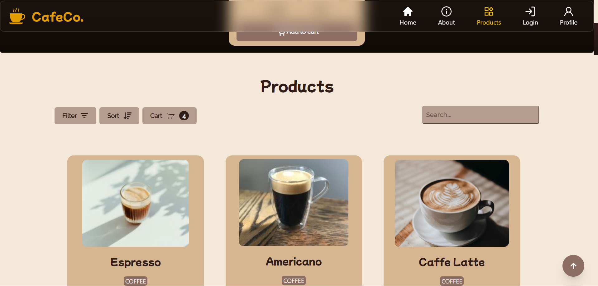
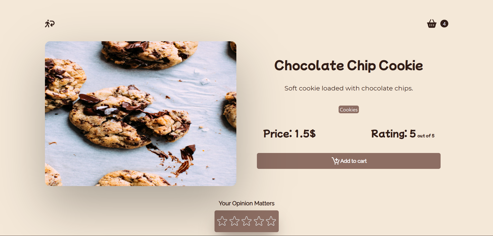
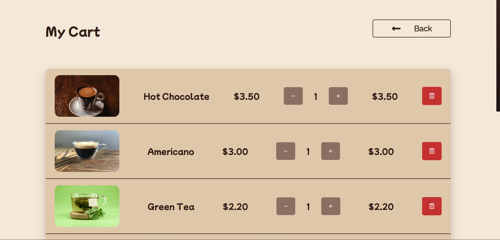
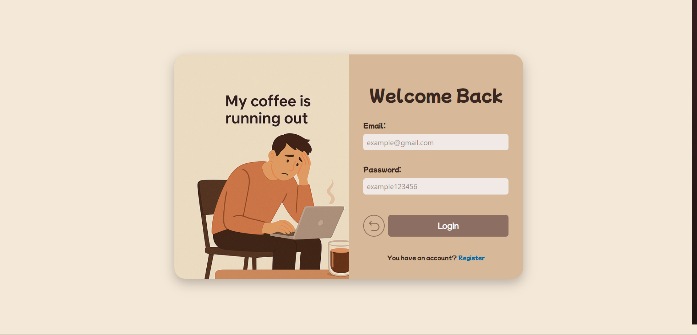

<div align="center">

# ☕ CafeCo Store

### Modern Coffee Shop E-Commerce Website

A modern, fully responsive coffee shop e-commerce application built with **React**, **Redux Toolkit**, **Tailwind CSS**, **Framer Motion**, and **JSON Server**.

<br/>

🔗 **Live Demo**

## https://cafeco-store.vercel.app/

</div>

# ✨ Preview

> Replace these images with your own screenshots.

## 🛍️ Products

<p align="center">
  
</p>

---

## ☕ Product Details

<p align="center">
  
</p>

---

## 🛒 Shopping Cart

<p align="center">
  
</p>

---

## 🔑 Login page

<p align="center">
  
</p>

---

# 🚀 Features

- 🔐 Authentication System
- 👤 User Profile
- 📍 Address Management
- 🛒 Shopping Cart
- 📦 Recent Orders
- 📄 PDF Invoice Generation
- 🎁 Reward Score System
- 🔍 Product Search
- 🧩 Category Filtering
- 📊 Product Sorting
- 📱 Fully Responsive Design
- 🎨 Custom UI/UX Design
- ⚡ Smooth Page Animations
- 🍪 Cookie-based Authentication

---

# 🛠️ Tech Stack

| Frontend     | State Management | Styling       | Backend     |
| ------------ | ---------------- | ------------- | ----------- |
| React        | Redux Toolkit    | Tailwind CSS  | JSON Server |
| React Router | Redux Thunk      | Framer Motion | REST API    |
| React PDF    |                  | React Icons   |             |

---

# 📂 Folder Structure

```text
src
│
├── components
├── features
│   ├── auth
│   ├── cart
│   ├── products
│   └── advice
│
├── hooks
├── services
├── store
├── ui
├── utils
└── pages
```

---

# ⚙️ Installation

Clone the repository

```bash
git clone https://github.com/daniHash/Cafeco-store.git
```

Go to the project

```bash
cd cafeco-store
```

Install dependencies

```bash
npm install
```

Start JSON Server

```bash
npm run server
```

Start the development server

```bash
npm run dev
```

---

# 📌 Environment

```
Node.js >= 18
npm >= 10
```

---

# 🌟 Highlights

- Designed from scratch in **Figma**
- Developed entirely with **React**
- State managed using **Redux Toolkit**
- Local REST API powered by **JSON Server**
- Modular and scalable folder structure
- Clean reusable components
- Responsive across all devices

<div align="center">

### ⭐ If you like this project, consider giving it a star!

Made with ❤️

</div>
